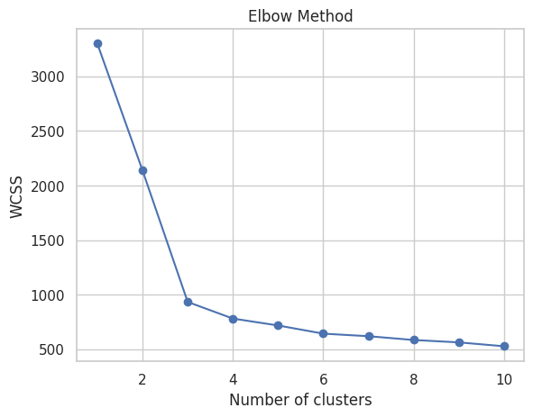
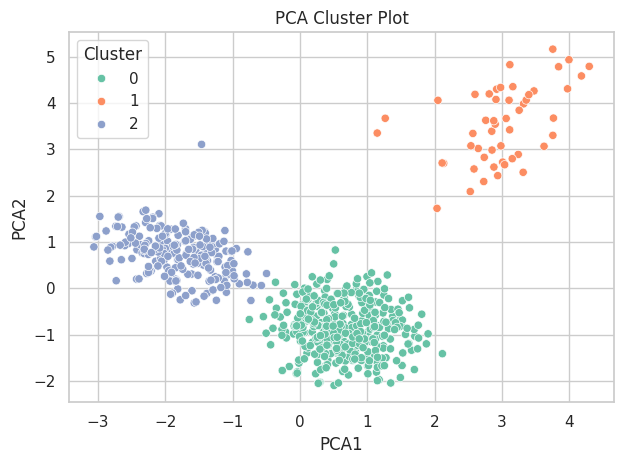

# 💳 Credit Card Customer Analysis & Churn Prediction

## 📌 Problem Statement
This project aims to analyze customer behavior and predict churn using historical credit card usage data. Insights will support retention strategies and product improvements for my client's POS sysytem for customer retention, helping identify at-risk users early, and boost long-term engagement.
---

## Dataset Overview

- **Source**: [Kaggle Dataset](https://www.kaggle.com/datasets/aryashah2k/credit-card-customer-data/data)
- **Size**: 10,000+ anonymized customer records
- **Features**: Demographics, credit usage, online/bank/call behavior

---

## Project Goals

- Identify natural clusters in customer behavior using K-Means
- Use PCA for cluster visualization
- Profile each segment to inform strategic business recommendations

---

## Dataset Overview

- **Source**: Simulated data (based on anonymized banking behaviors)
- **Observations**: ~10,000 customers
- **Features Used**:
  - Average Credit Limit
  - Total Credit Cards
  - Bank Visit Frequency
  - Online Interaction Frequency
  - Call Center Usage

---

## Tools & Technologies

- **Python**: `pandas`, `numpy`, `seaborn`, `matplotlib`, `scikit-learn`
- **Modeling**: KMeans Clustering, PCA
- **Notebook**: [📓 View the notebook](./Cleaned_Customer_Segmentation_Notebook.ipynb)

---

## Workflow Summary

1. **Data Cleaning** – Removed identifiers and duplicates
2. **EDA** – Visualized distributions and correlations
3. **Feature Standardization** – Prepared data for clustering
4. **Elbow Method** – Determined optimal clusters (k=3)
5. **KMeans Clustering** – Assigned cluster labels
6. **PCA Visualization** – Reduced to 2D for visual clarity
7. **Segment Profiling** – Interpreted business behaviors in each group

---

## Choosing Optimal Clusters (Elbow Method)

We used the Elbow Method to determine the ideal number of clusters. The graph below indicates that **k=3** is the most efficient choice:

## PCA Cluster Visualization

To visually validate our customer segmentation, PCA (Principal Component Analysis) was used to reduce the dimensionality of the dataset. This scatter plot shows clear separation between the three identified clusters:

---
## Customer Segments Identified

| Cluster | Description              | Strategy                                |
|---------|--------------------------|------------------------------------------|
| 0       | Dormant Users            | Re-engage with incentives or outreach   |
| 1       | Digital Enthusiasts      | Upsell through loyalty programs         |
| 2       | Support-Reliant Users    | Promote digital tools, reduce support load |

---

## Business Impact

-  Personalized retention strategies
- Reduced operational costs by nudging support-heavy users to digital
-  Improved marketing ROI through persona-driven targeting
